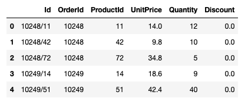
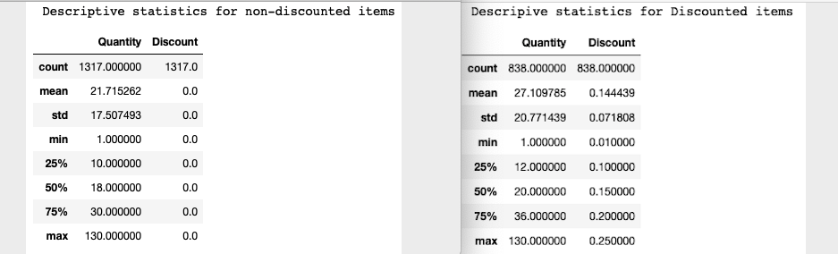
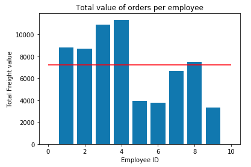
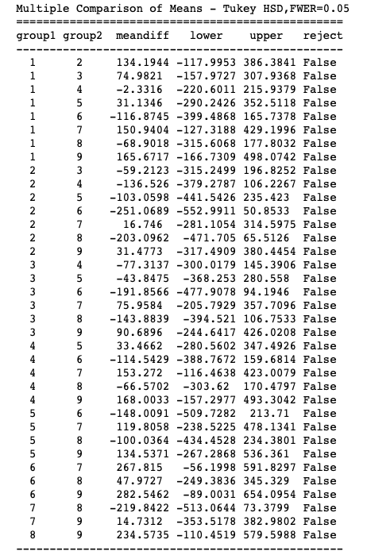
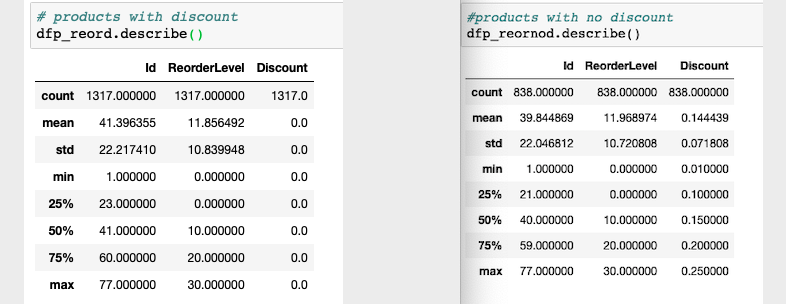

# Northwind Traders Statistical Analysis
### Advance Data Retrieval and Analysis


<p>The goal of this project is to test the ability to gather information from a real-world databse and use statistical analysis and hypothesis testing to generate analytical insights.</p>
<p>The data used for this project is sourced from Microsoft's fictional company Northwind Traders. An sqlite-compatible file has been provided and it's included in the folder along with the notebooks. The project requirements can be found in the index.ipynb file.</p>

### Analysis of hypothesis 1
Do discounts have a statistically significant effect on the number of products customers order? If so, at what level(s) of discount?

    * $H_o$: discounts do not have an effect on the number of products ordered. $\mu_1 =\mu_2$
    * $Ha$: discounts have an effect in the number of products ordered. $\mu_1 \neq \mu_2$

Table needed: Order (attributes: orderid, quantity, discount)<br>


Descriptive Statistics: <br>


<br>
Two tail T-Test:
Ttest_indResult(statistic=-6.239069142123973, pvalue=5.65641429030433e-10)
##### Interpretation:
The null hypothesis is rejected. Discounts do have an effect on the number of products ordered by clients.

2. How sales compare across the different regions.
3. How sales by employees compare among themselves.
4. Do discounts affect re-orders?

### Analysis of hypothesis 2
How sales and revenue compare across the regions?

* $H_o$: the average sales in all regions are equal . $\mu_1 = \mu_2$
* $Ha$: the average sales in all regions are not equal  $\mu_1 \neq \mu_2$
<br>
Variables needed: <br>


<br>
Variance:
TotalSum: 63293156.85691343
Sales: 6458.172839506174Two Tail T-Test
Ttest_indResult(statistic=2.5324795599914967, pvalue=0.03511398310242245)
The null hypothesis is rejected, this confirms that the average sales are not equal in all regions. Further analysis can be to check what regions have a high sales value. This can be done with a Tukey test to get a comparison of all regions.

### Analysis of hypothesis 3

How employee sales compare among themselves?

* $H_o$: sales revenue/sale by employees on average are the same value $\mu_1 =\mu_2$
* $Ha$: there is an employee that generates more revenue/sale than the average $\mu_1 >=\mu_2$

 <br>

####  Test: ANOVA
Assumptions to be satisfied in order for the associated p-value to be valid.

    The samples are independent.
    Each sample is from a normally distributed population.
    The population standard deviations of the groups are all equal (homoscedasticity)

The assumption of homoscedasticity does not hold in this case, so we use the Kruskal-Wallis H-test which tests the null hypothesis that the population median of all of the groups are equal. It is a non-parametric version of ANOVA.

#The Kruskal Wallis test is the non parametric alternative to the One Way ANOVA. 
#It determines whether the medians of two or more groups are different

stats.kruskal(x,y)
KruskalResult(statistic=12.78947368421052, pvalue=0.0003485751742130545)
The p-value is much lower than the statistic value; hence the null hypothesis is rejected. We proceed to confirm this with Tukey test and if true we'll find out which employee is selling more (which specific means are different).

<br>

There is a difference in the average sales per employee but there is no statistical difference between them, hence the null hypothesis is not rejected, and there is not significant evidence to support the alternate hypothesis.

### Analysis of hypothesis 4
Do discounts affect reorders?

* $H_o$: discounts have an effect on reorders $\mu_1 =\mu_2$
* $Ha$: discounts do not have an effect in reorders $\mu_1 \neq \mu_2$

<br><br>

Two Tail T-Test:
Ttest_indResult(statistic=-0.23641044437129016, pvalue=0.8131411415021936)
The p-value in this case is greater than the significance level, so the null hypothesis is not rejected.

## Summary

1. Do discounts have a statistically significant effect on the number of products customers order? 
    * $H_o$: discounts do not have an effect on the number of products ordered. $\mu_1 =\mu_2$
    * $Ha$: discounts have an effect in the number of products ordered. $\mu_1 \neq \mu_2$
<p>The null hypothesis is rejected. Discounts do to have a stistically siginificant effect on the number of products ordered by clients.</p><br>

2. How sales and revenue compare across the regions. 
    * $H_o$: the average sales in all regions are equal . $\mu_1 = \mu_2$
    * $Ha$: the average sales in all regions are not equal  $\mu_1 \neq \mu_2$
<p>The null hypothesis is rejected, this confirms that the average sales are not equal in all regions. Further analysis can be to check what regions have a high sales value. This can be done with a Tukey test to get a comparison of all regions. </p><br>

3. How employee sales compare among themselves
    * $H_o$: sales revenue by employees on average are the same value $\mu_1 =\mu_2$
    * $Ha$: there is an employee that generates more revenue than the average $\mu_1 >=\mu_2$
<p>There is a difference in the average sales per employee but there is no statistical difference between them, hence the null hypothesis is not rejected, and there is not significant evidence to support the alternate hypothesis.</p><br> 

4. Do discounts affect reorders?
    * $H_o$: discounts have an effect on reorders $\mu_1 =\mu_2$
    * $Ha$: discounts do not have an effect in reorders $\mu_1 \neq \mu_2$
<p>The alternate hypothesis that discounts do not have an effect in reorders is weak, so the null hypothesis can not be rejected.</p>


```python

```
